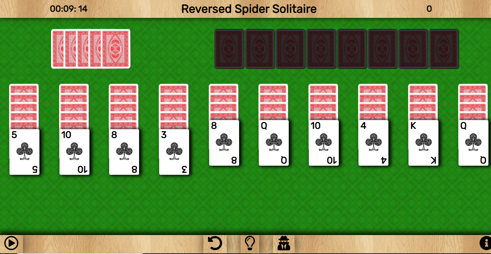
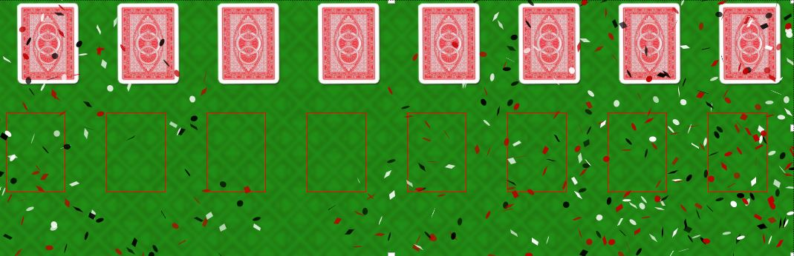
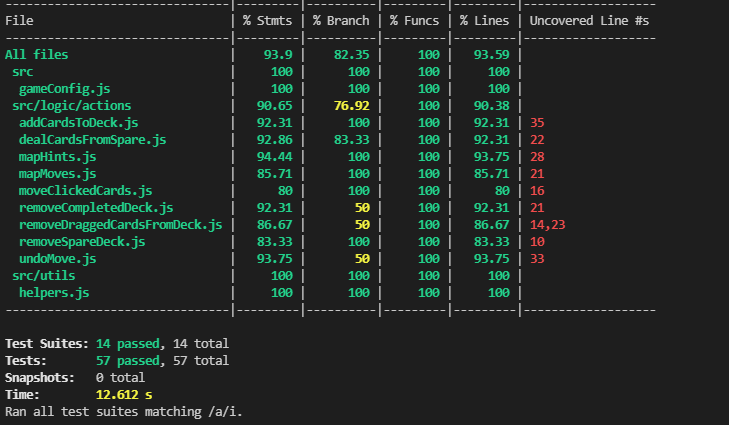
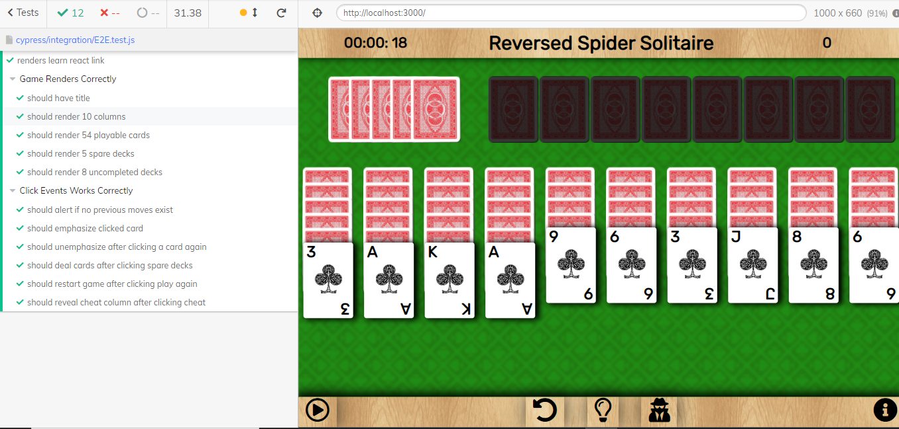
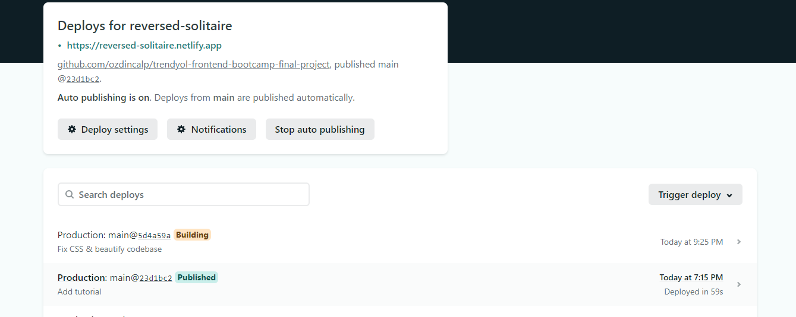
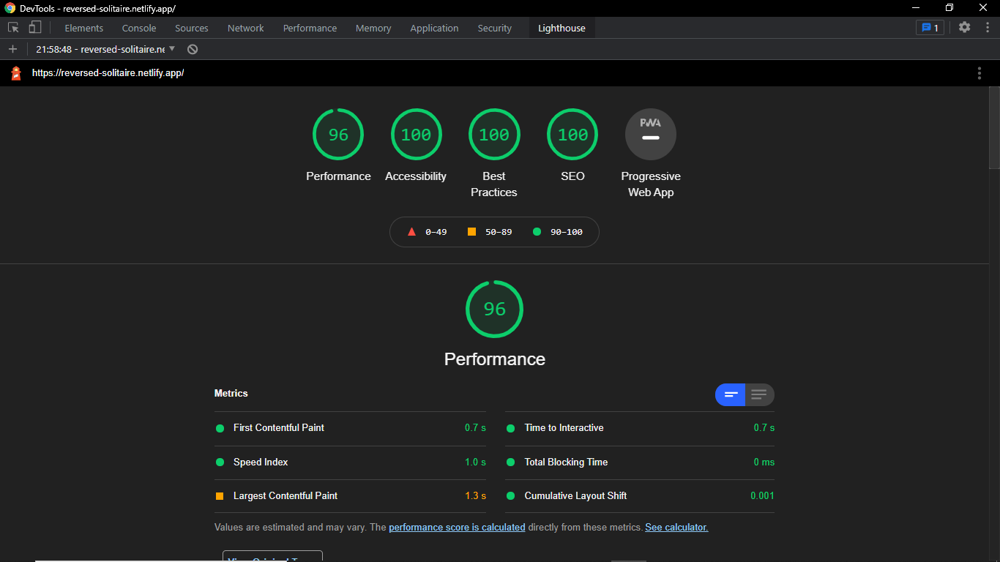
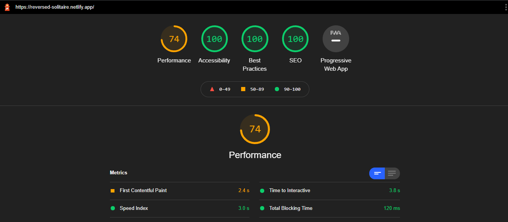
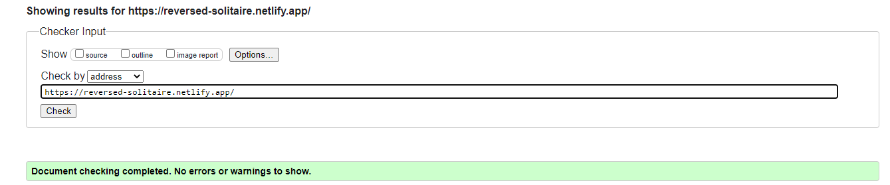

# Reversed Spider Solitaire with React

Reversed version of card game Spider Solitaire. Built as Trendyol Frontend Bootcamp graduation project. Enjoy!

## Game
* Game is about list consecutive cards from A to K (A,2,3,4,5,6,7,8,9,10,J,Q,K).
* Game starts with 104 cards (8 decks).
* 54 cards are initially playable, 50 cards are reserved to deal later.

## Extra Features in Project

* Cheat
* Undo move
* Show hint
* Scoreboard

## Game Implementation Details

* Game supports both drag & drop and click move. 
* Completed decks removed right away.
* User can undo moves up to 100 times.
* Dealing cards from spare decks resets the moves to undo. 
* Card animation is showed if hint button is clicked.
* Cheat feature reveals an additional column. User can move cards onto/from that column for 10 seconds. If there are still cards on cheat column, they will be randomly located.
* Confetti throw animation will start after winning the game.

## Technologies & Tools
* React
* React DnD
* SASS
* Jest
* Cypress
* Netlify CI/CD

## Unit & E2E Tests
* %94 unit test coverage

* 12 Cypress UI test

## CI/CD 
* Netlify CI/CD is used for auto-deploy.

## Lighthouse Scores
* 96 performance score on desktop

* 74 performance score on mobile

## W3C Validation

## Setup Project On Local

### `yarn`

### `yarn start`

### `yarn test`

### `yarn build`
